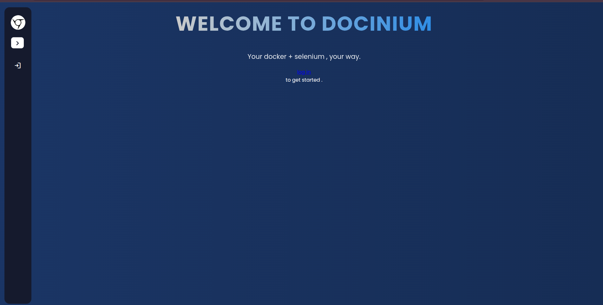
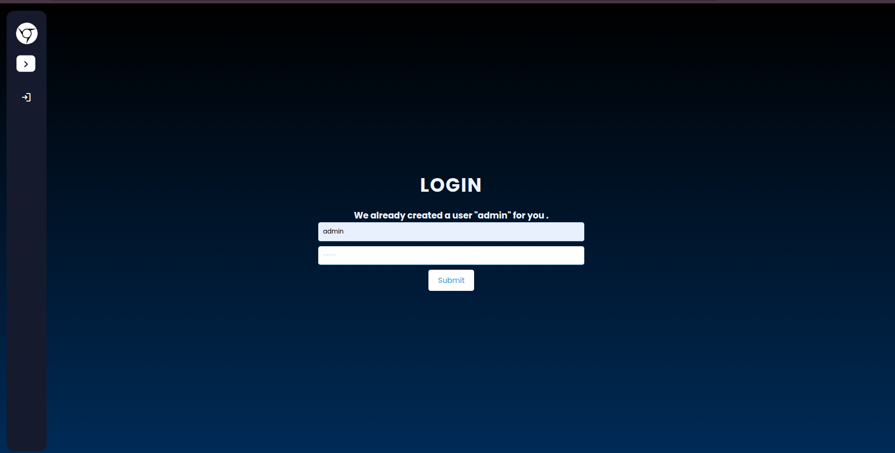
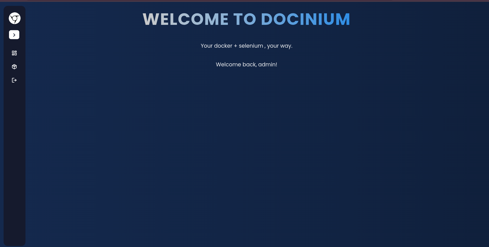
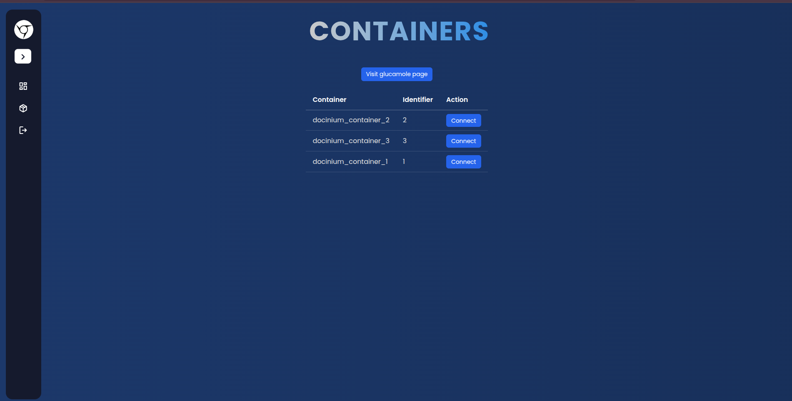
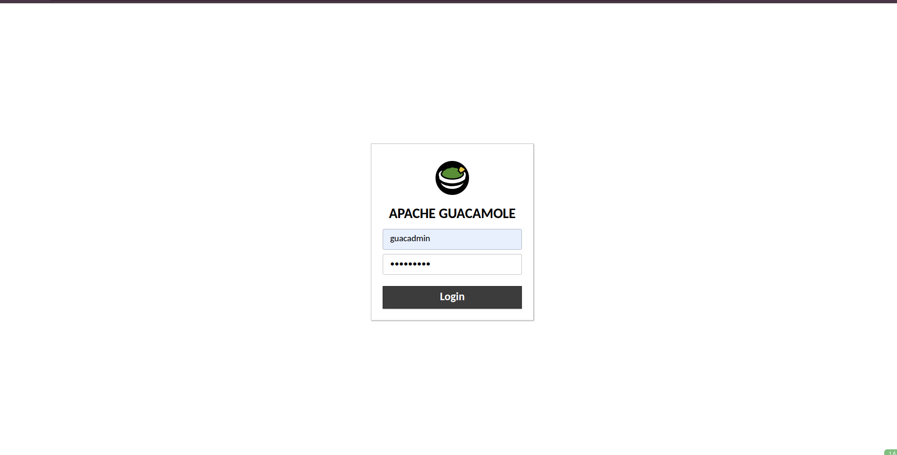
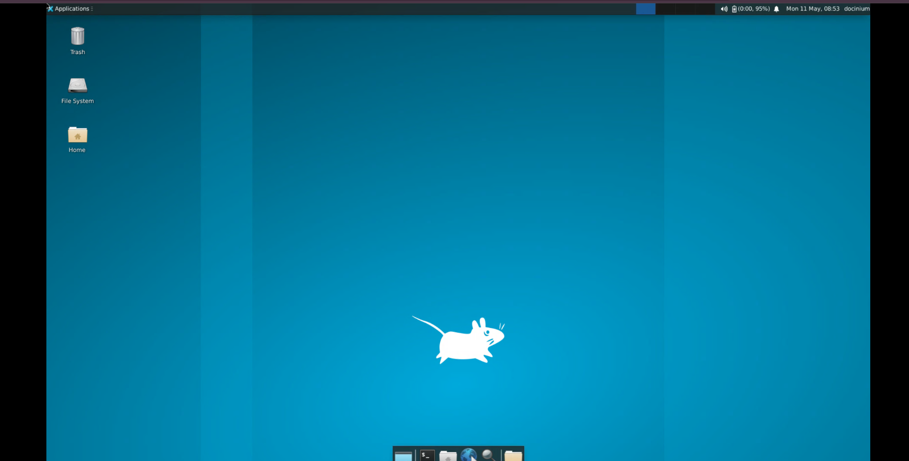
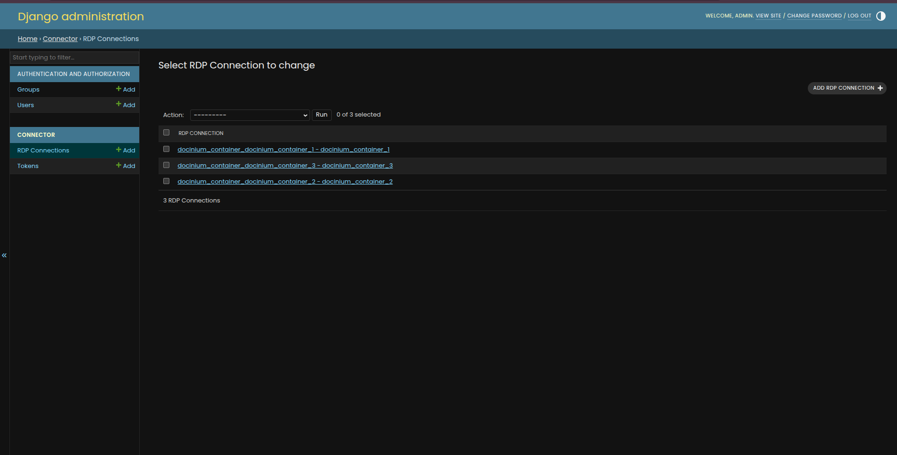

# Docinium

Your container desktops, one browser away.

---

## Introduction

Docinium is a platform for orchestrating and interacting with multiple containerized desktop environments through a unified browser interface.

Built using Python and Docker, Docinium enables secure, isolated, and scalable desktop sessions that can be accessed and controlled directly from the web. It is designed to simplify remote desktop infrastructure, browser-based interaction, and multi-container desktop management for developers, automation systems, and accessibility-focused applications.
---

## Setup

### Clone the repository

```sh
git clone https://github.com/AYUSHKHAIRE/docinium
cd docinium
```

### Create a Python environment

```sh
python3.12 -m venv env
```

### Activate the environment

```sh
source env/bin/activate
```

### Install dependencies

```sh
pip install -r requirements.txt
```

### Build the Docker image

```sh
cd docinium/container/
docker build -t docinium_container .
cd ../..
```

---

## Get Started

You can write your own orchestration logic or refer to `main.py`.

```python
"""
Core imports.
"""

from docinium import DocShip
from docinium import Container


"""
Think of Docinium like a ship management system.

- A DocShip manages multiple containers.
- Each Container runs an isolated desktop environment.
- The ship docks on a port and allows browser interaction.
"""


"""
Port where the ship will dock.
"""
PORT = 23505


"""
Create and dock the ship.
"""
ship = DocShip(
    name="ship_1",
    port=PORT
)

ship.dock()


"""
Create a desktop container.
"""
container = Container(
    name="container_1",
    port_to_connect=PORT
)


"""
Mount the container onto the ship.
"""
ship.mount(container)


"""
Keep the ship running.
"""
ship.wait(60)


"""
Interact with the desktop remotely.
"""
container.send_message(
    type="desktop_click",
    message={
        "click": {
            "x": 30,
            "y": 30
        }
    }
)


"""
Wait before shutting down.
"""
ship.wait(300)


"""
Undock and clean up resources.
"""
ship.unDock()
```

---

## Demo

According to the example above, you can access the web interface at:

```text
http://0.0.0.0:23505
```

You should see a screen like this:



You can now navigate to the login page and log in using the following credentials:

```text
Username: admin
Password: admin
```



After logging in, return to the home page.



On the sidebar, you will see the **Admin** and **Containers** sections.



Inside the Containers page, you can view all currently docked containers on the ship, along with:
- Direct desktop access links
- A direct link to the Apache Guacamole dashboard

You can open the Guacamole page and log in using:

```text
Username: guacadmin
Password: guacadmin
```



Returning to the Containers page, you can click the direct desktop button for any running container.

This will open the containerized desktop environment in your browser.



Additionally, Docinium provides a Django admin panel where you can manage users and monitor active RDP connections.

